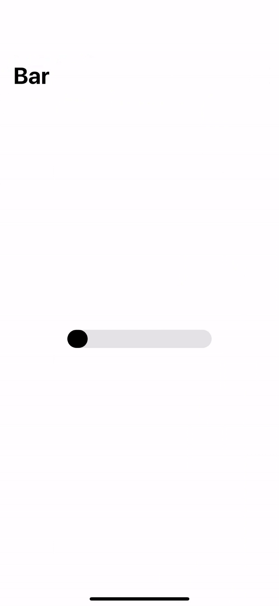
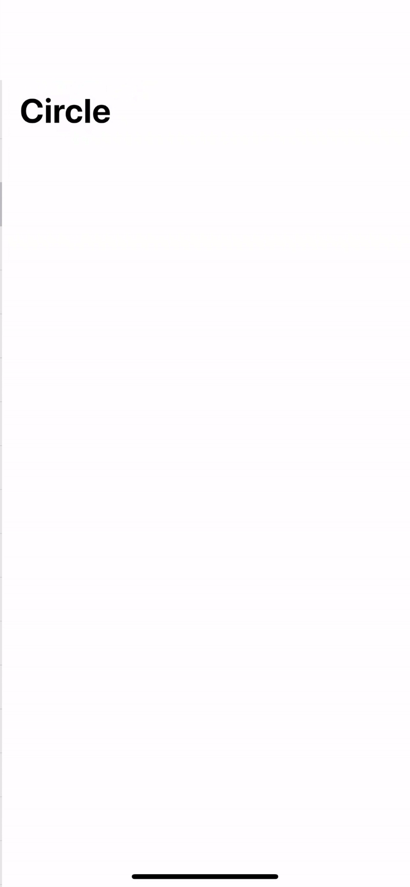
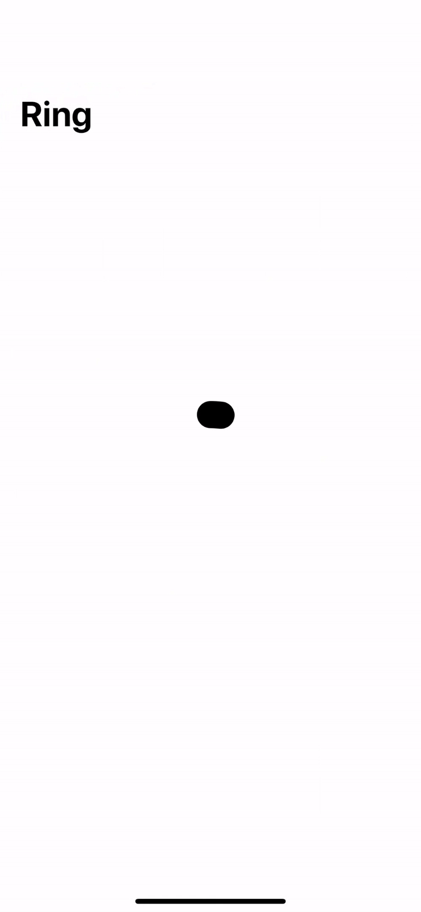

# GCProgressView

<p align="middle">
  
   
  
</p>

## Installation

`GCProgressView` is available as a [Swift Package](https://developer.apple.com/documentation/swift_packages). You can find information on how to add package dependencies to your app [here](https://developer.apple.com/documentation/xcode/adding_package_dependencies_to_your_app).

## Usage

```swift
import GCProgressView
```

```swift
GCProgressView(style: .bar, progress: self.$progress)
GCProgressView(style: .circle, progress: self.$progress)
GCProgressView(style: .ring, progress: self.$progress)
```
